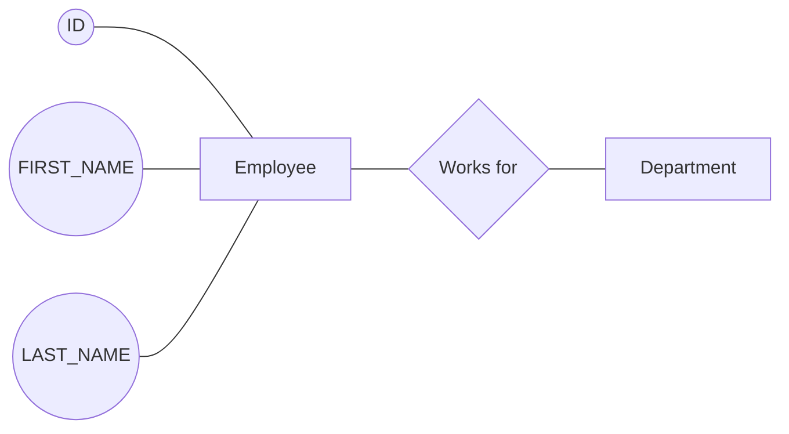
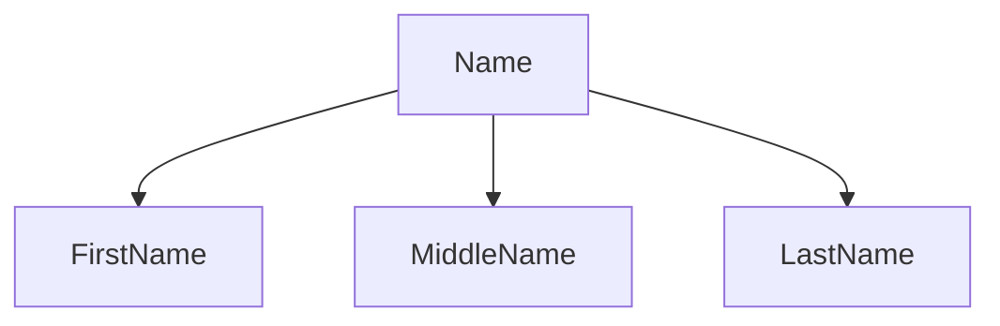

# Introduction

Data: Any fact that can be recorder or stored.

Database: Collection of data.

Database Management System: Program used to construct, manipulate, or retreive data from a database.

## Data Model

Representing the structure of the database.

### ER Diagram

Diagramatic Representation using nodes and connections.

### Tabular/Relational Model

Tables are used to represent the structure.

- Fields or Columns
- Records or Rows or Tuples
- Table or Relation

# ER Model

Entity - Objects we see in real world.
**EMPLOYEE** works for **DEPARTMENT**.

Relationship - Association between entities.
Employee **WORKS FOR** department.

Attributes - Properties for entities.
EMPLOYEE - **EMP_ID, FIRST_NAME, LAST_NAME**

## Simple Attributes

Cannot be split further.

## Composite Attribute

Can be split further.

## Single Value Attribute

Only one value. Example: Student can have only one AGE.

## Multi-valued Attribute

Can have multiple values. Example: Student can have multiple PHONE_NUMBER.

## Stored Attribute

We need to store the values for these attributes.

## Derived Attribute

The value for these attributes can be derived from values of other stored attributes.

Example: Age can be derived from date/year of birth.

## Complex Attribute

An attribute that is composite and multi-valued.

Example: Address can be split into multiple attributes and can contain multiple values.

# Relationships

*This relationship shows that EMPLOYEE can work for one and only one DEPARTMENT. Also, each DEPARTMENT can have N number of EMPLOYEES.*

## Cardinality Ratio

Ratio of number of relationships the entities can participate in.

CR, EMPLOYEE : DEPARTMENT - N : 1
CR, DEPARTMENT : EMPLOYEE - 1 : N

## Degree of Relationship

Number of entites participating in a relationship.

## Total Participation

This means each record in the relation is participating in at least one relationship instance.
Example: EMPLOYEE works for DEPARTMENT.

Here it is mandatory that each EMPLOYEE works for one and only one DEPARTMENT. Therefore each EMPLOYEE is participating in some relationship instance with DEPARTMENT. Therefore EMPLOYEE has total participation.

This relationship is shown using double lines.
EMPLOYEE === works for --- DEPARTMENT.

## Partial Participation

In the same example, each DEPARTMENT record may not be involved in at least one relationship instance. Therefore it has partial participation. It is shown using single lines.

## Recursive Relationship

When an entity has a relationship with itself.

Example: EMPLOYEE is managed by EMPLOYEE.

# Constraints

## Domain Constraints

- Domain should contain atomic values.
  *Therefore, multi-valued or composite attributes are not allowed.*
- Datatype check is done to ensure that domain contraints are followed.

## Key Constraints

- Uniqueness contraints ensures that each tuple can be uniquely identified.
- A relation can have multiple keys but the one with the least number of attributes is recommended.
- NULL values are not allowed in the primary key.

## Entity Integrity Contraints

This implies that no primary key can take NULL values.

## Referential Integrity Contraints

If an attribute is foreign key in one relation and primary key in another relation, there should be proper integrity in the references. 

### Example

<u>STUDENT TABLE</u>

| ID   | Name  | LocationID |
| ---- | ----- | ---------- |
| 1    | Jacob | 12         |
| 2    | Mary  | 13         |
| 3    | Ryan  | 13         |
| 4    | Steph | 44         |

<u>LOCATION TABLE</u>

| LocationID | Address |
| ---------- | :------ |
| 12         | Tempe   |
| 13         | Phoenix |

Here LOCATION_ID is foreign key in STUDENT table and a reference to LOCATION table. But there is inconsistency because there is no record corresponding to the LOCATION_ID 44. That is against referential integrity contraints.

# Keys

## Primary Key

Uniquely identifies a row/record in the database table.

## Foreign Key

Uniquely identifies a row/record in another table.

# Normalization

Process of efficiently organizing data in the database.

- Eliminate redundancy from the database.
- Ensure data dependencies make proper sense.

## Table without normalization

### Students

| StudentID | Advisor | Adv-Room | Class1 | Class2 | Class3 |
| :-------- | :------ | :------- | :----- | :----- | :----- |
| 1022      | Jones   | 412      | 101-07 | 143-01 | 159-02 |
| 4123      | Smith   | 216      | 101-07 | 143-01 | 179-04 |

## First Normal Form

The relation should contain atomic values only. No repeating groups.

It is a very bad idea to have three columns for CLASS. This makes it multi-valued attribute.

### Students

| Student# | Advisor | Adv-Room | Class# |
| :------- | :------ | :------- | :----- |
| 1022     | Jones   | 412      | 101-07 |
| 1022     | Jones   | 412      | 143-01 |
| 1022     | Jones   | 412      | 159-02 |
| 4123     | Smith   | 216      | 101-07 |
| 4123     | Smith   | 216      | 143-01 |
| 4123     | Smith   | 216      | 179-04 |

## Second Normal Form

Eliminate redundant data.

### Students

| Student# | Advisor | Adv-Room |
| :------- | :------ | :------- |
| 1022     | Jones   | 412      |
| 4123     | Smith   | 216      |

### Registration

| Student# | Class# |
| :------- | :----- |
| 1022     | 101-07 |
| 1022     | 143-01 |
| 1022     | 159-02 |
| 4123     | 101-07 |
| 4123     | 143-01 |
| 4123     | 179-04 |

## Third Normal Form

Eliminate data not dependent on key. 

Here the advisor's room is removed from the student's table and stored as separate table.

### Students

| Student# | Advisor |
| :------- | :------ |
| 1022     | Jones   |
| 4123     | Smith   |

### Faculty

| Name  | Room |
| :---- | :--- |
| Jones | 412  |
| Smith | 216  |

---

# Keys

## Super Key

A set of one or more attributes that can be used to uniquely identify the records of a database.

## Candidate Key

A minimal super key with no redundant attributes. Candidate key should not have redundant attributes that are not necessary for unique classification.

## Primary Key

This is the key that is selected from the set of candidate keys. This is generally done by database admin or designer.