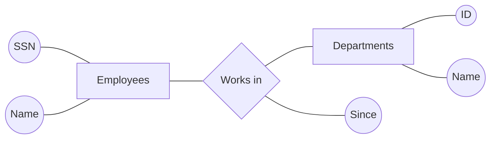
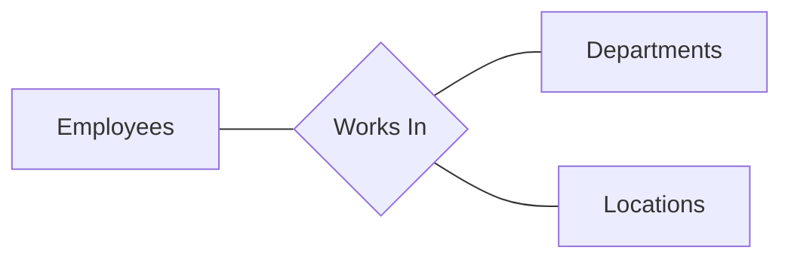
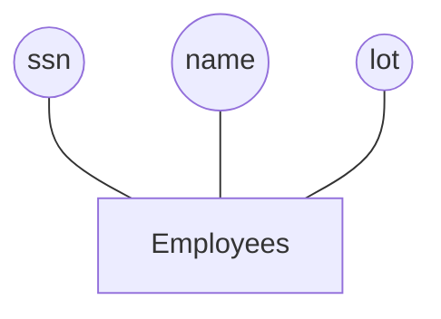
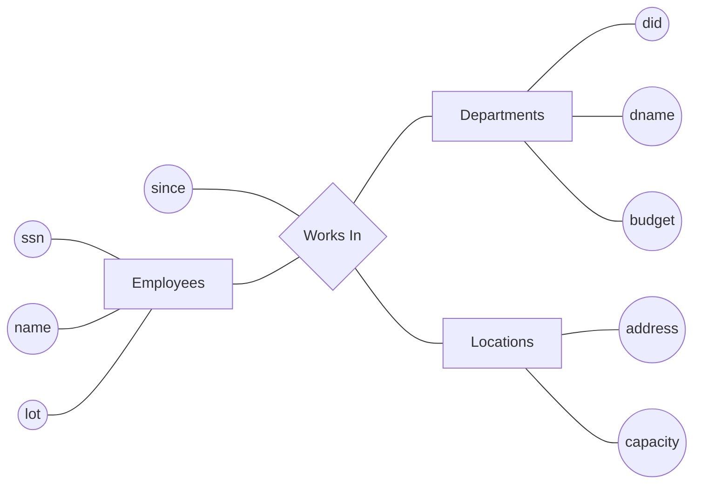
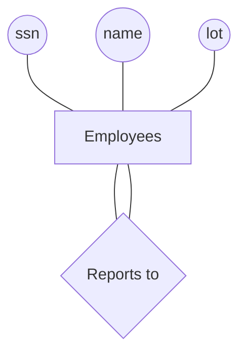
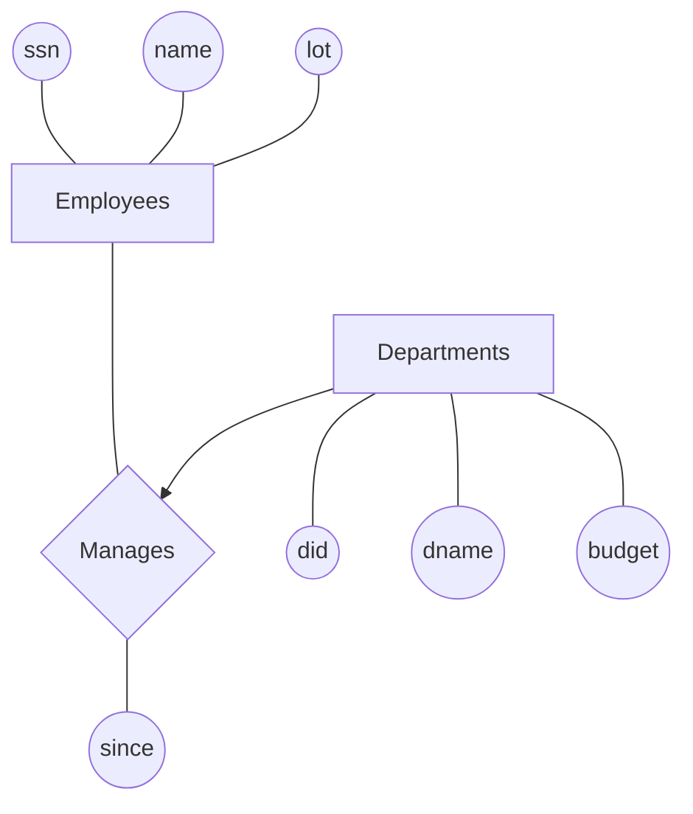
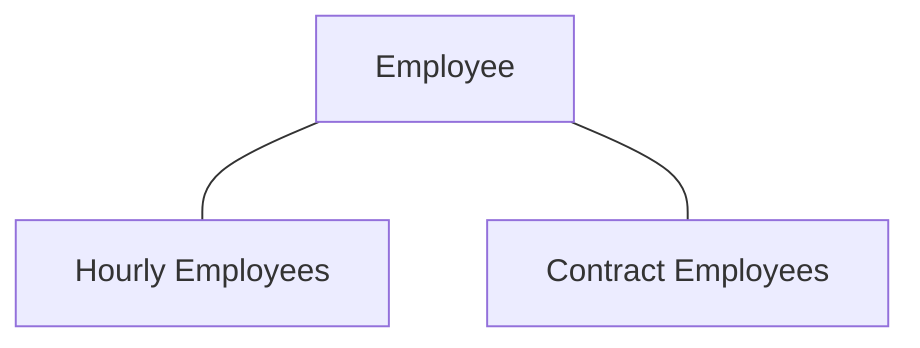

# 1. Overview

## History

- First general purpose DBMS - 1960s.
- Relational DBMS is proposed by Edgar Codd - 1970 - IBM's San Jose Research Lab.

## File System versus DBMS

- Access Issue for large datasets in case of general filesystem.
- Special programs to answer each query user posts about the data.
- Need protection from inconsistent changes in the data.
- System Failure Recovery.
- Security Enforcement.

## Advantages of DBMS

- Abstraction - Restricted exposure to data representaion and storage.
- Efficient Data Access.
- Integrity and Security - Example: DBMS can ensure the value of a particular attribute doesn't exceed a particular range/value.
- Administration Options.
- Concurrent Access and Crash Recovery.
- Reduced Application Development Time.

## Relational Model

### Schema

Description of data in terms of a data model. The schema of a relation specifies its name, the name of each field, and the type of each field.

Example: `Students(id: integer, name: string, login: string, age: integer)`

Integrity constraints can be enforced on each of the fields in the student schema. They are used to make sure that certain conditions are followed for the value assigned to each field.

## Levels of Abstraction in DBMS

DBMS Description consists of a schema at each of the three levels: External, Conceptual, and Physical.

### Conceptual Schema

- Also called logical schema.
- Describes all the relations that are stored in the database.
- Process of arriving at the schema with good choice of relations and fields for each relation, is called **conceptual database design.**

### Physical Schema

It deals with how the relations described in conceptual schema are stored on physical storage devices.

### External Schema

This allows data access to be customized at a level of individual user or groups of users. Any given database has single conceptual and physical schema but can have multiple external schemas.

### Data Independence

All the three layers of DB Schema are independent from each other.

## Transaction Management

- It is the basic unit of change as seen by the DBMS.
- Partial transactions are not allowed.
- Transaction changes should not be lost in case of system failure.
- User should not care about other users access/modifying the same resource.

### Locking Protocol

- Set of rules used to ensure proper transaction consistency.
- **Lock** is a mechanism used to control access to the database objects. 
  - **Shared Lock**: can be held by two different transactions at the same time.
    Used when reading the resources.
  - **Exclusive Lock** can only be held by one transaction at a time and no other transaction can take place on that object.
    Used when modifying the resources.

### WAL (Write Ahead Log)

- Each write action must be recorded in the log (on disk) before reflecting the same change on the database itself.

---

# 2. Database Design

## Design Process

1. Requirement Analysis
   - What data is stored?
   - What applications must be built on top of it?
   - What operations are most frequent and subject to performance requirements?
2. Conceptual Database Design
   - High Level Description of Data and constraints.
   - Carried out using ER Diagram.
3. Logical Database Design
   - Choose a DBMS.
   - Convert the ER Schema into DBMS Relations.
4. Schema Refinement
   - Identify potential problems and refine them.
5. Physical Schema Design
   - Identify performance criteria
   - Make respective changes.
     Some tables may require indexing while other need clustering.
6. Application and Security Design

### Entity

Real world object distinguishable from other objects.

### Entity Set

Collection of similar entities.

### Keys

Set of attributes that can be used to uniquely identify an entity in the set.

- Primary Key
- Candidate Key

## Relationship

Relationship is an association among two or more entities. 

### Descriptive Attributes

Descriptive attributes are used to record information about the relationship rather than about the participating entities.

Example: `Since` is a descriptive attribute.



### Ternary Relationship

The relationship is ternary when it is shared between three entities. Example: Employee, Department and Location.




### Total Participation

If each record in the entity set participates in the relationship with another entity set, it is said to be total participation. Otherwise it is called **partial participation.**

### Weak Entity

Entity Set `A` and `B` are related. Example: Employee and their dependents.
Dependents cannot be uniquely identified and require maybe the firstname of the Employee they are related to. In this case, dependents are weak entity and employees are identifying owner. The relationship will be called Identiftying Relationship.

#### Conditions for Weak Entity

1. Owner and weak entity have one to one relation. Although owner can be related to multiple weak entities related to it.
2. Weak entity must ensure total participation.

### Inheritance

#### Specialization

Employee is specialized in certain subclasses.

#### Generalization

Hourly Employees and Contract Employees are generalized by Employees.

#### Overlap Constraints

It specifies if any entity can be a part of two subclasses. Example: Someone can be senior and contract employee.
It is specified as `Contract_Employees OVERLAPS `

#### Covering Constraints

It specifies if each entity needs to be a part of the subclasses. Example: Each motor-vehicle needs to be either a car or a motorboat.
This is specified as `Motorboats AND Cars COVER Motor_Vehicles.`

#### Aggregation

It specifies that a given relationship participates in another relationship set. 

---

# 3. The Relational Model

## Creating/Modifying Relations using SQL

### CREATE

```SQL
CREATE TABLE Students (id CHAR(20),
                      name CHAR(30),
                      login CHAR(20),
                      age INTEGER,
                      gpa REAL)
```

### INSERT

```SQL
INSERT
INTO Students (id, name, login, age, gpa)
VALUES (10145, 'Smith', 'smith@ee', 18, 3.2)
```

### DELETE

```sql
DELETE
FROM Students S
WHERE S.name = 'Smith'
```

### UPDATE

```sql
UPDATE Students S
SET S.age = S.age + 1, S.gpa = S.gpa - 1
WHERE S.sid = 10145
```

### Specifying Key Constraints in SQL

```sql
CREATE TABLE Students (id CHAR(20),
                      name CHAR(30),
                      login CHAR(20),
                      age INTEGER,
                      gpa REAL,
                      UNIQUE (name, age),
                      CONSTRAINT StudentsKey PRIMARY KEY (id))
```

`Unique(name, age)` means that this is a candidate key.
`CONSTRAINT StudentsKey PRIMARY KEY (id)` is the primary key and there can be only one primary key.

### Specifying Foreign Key Constraints in SQL

**Enrolled Table**: (Referencing Relation)
	CourseID, Grade, StudentID

**Students Table**: (Referenced Relation)
	StudentID, Name, Login, Age, GPA

In Enrolled Table, StudentID is a foreign key.

```sql
CREATE TABLE Enrolled (studentID CHAR(20),
                      courseID CHAR(20),
                      grade CHAR(10),
                      PRIMARY KEY (studentID, courseID),
                      FOREIGN KEY (studentID) REFERENCES Students)
```

## Enforcing Integrity Constraints

### Handling Foreign Key Violations

1. What should be done if an enrolled row is inserted, with a `studentID` that doesn't appear in any row of the `Students` Table?
   - Insertion is simply rejection.
2. What should be done if the Students row is deleted?
   - `CASCADE` : Delete all enrolled rows that refer to the deleted students row.
   - `NO ACTION` : Disallow the operation if the enrolled refers to it.
   - `SET DEFAULT` : Set the student ID (enrolled table) to ID of some default student for every enrolled student referring to deleted students.
   - `SET NULL` : Set the student ID (enrolled table) to *null*. This becomes a conflict if it is the part of primary key.
3. What should be done if the primary key value of the students row is updated?
   - Same as options for DELETION.

```sql
CREATE TABLE Enrolled (studentID CHAR(20),
                      courseID CHAR(20),
                      grade CHAR(10),
                      PRIMARY KEY (studentID, courseID),
                      FOREIGN KEY (studentID) REFERENCES Students
                      	ON DELETE CASCADE
                      	ON UPDATE NO ACTION)
```

## Transactions and Constraints

A program that runs against a database is called a transaction and it can include several statements.

Example: We have two tables that reference each other as foreign key. 
Students:
	ID, Name, CourseID
Courses:
	ID, Name, GraderID

How to insert the first entry into any of these tables? In such constraint checking can be put into `DEFERRED` or `IMMEDIATE` mode.

```sql
SET CONSTRAINT ConstraintName DEFERRED
```

## Querying Relational Data

```sql
SELECT *
FROM Students S
WHERE S.age < 18 AND S.grade = 'A'
```

```sql
SELECT S.name, E.courseID
FROM Students S, Enrolled E
WHERE S.studentID = E.studentID AND E.grade = 'A'
```

## ER to Relational Design

### Entity Sets to Tables



| SSN         | Name   | Lot  |
| ----------- | ------ | ---- |
| 123-22-3666 | Jacob  | 32   |
| 432-34-1234 | Harris | 41   |

```sql
CREATE TABLE Employees (ssn CHAR(11),
                       name CHAR(30),
                       lot INTEGER,
                       PRIMARY KEY (ssn))
```

### Relationship Sets to Tables

Relationship Table uses the primary keys of all the participating entity sets.



| SSN         | DID  | Address              | Since |
| ----------- | ---- | -------------------- | ----- |
| 123-32-4323 | 32   | 1500 N Kate Rd, City | 2019  |
| 123-32-1422 | 23   | 1400 E Red Rd, City  | 2003  |


```sql
CREATE TABLE Works_in (ssn CHAR(11),
                      did INTEGER,
                      address CHAR(20),
                      since DATE,
                      PRIMARY KEY (ssn, key, address),
                      FOREIGN KEY (ssn) REFERENCES Employees,
                      FOREIGN KEY (address) REFERENCES Locations,
                      FOREIGN KEY (did) REFERENCES Departments)
```

#### Self Loop



```SQL
CREATE TABLE Reports_to (supervisor_ssn CHAR(11),
                        subordinate_ssn CHAR(11),
                        PRIMARY KEY (supervisor_ssn, subordinate_ssn),
                        FOREIGN_KEY (supervisor_ssn) REFERENCES Employees(ssn),
                        FOREIGN_KEY (subordinate_ssn) REFERENCES Employees(ssn))
```

### Relationship Sets with Key Constraints

The arrow from `Departments` to `Manages` states that each department has at most one manager. Each department has different `did` but can have same `ssn`.  This means `did` is the key for `Manages` table.



#### Approach 1

```sql
CREATE TABLE Manages (ssn CHAR(11),
                     did INTEGER,
                     since DATE,
                     PRIMARY KEY (did),
                     FOREIGN KEY (ssn) REFERENCES Employees,
                     FOREIGN KEY (did) REFERENCES Departments)
```

#### Approach 2

```sql
CREATE TABLE Department_Manager(did INTEGER,
                               dname CHAR(20),
                               budget REAL,
                               ssn CHAR(11),
                               since DATE,
                               PRIMARY KEY (did),
                               FOREIGN KEY (ssn) REFERENCES Employees)
```

### Relationship Sets with Participation Constraints

This constraints says that each department is required to have a manager.

The approach 2 from Relationship Sets with Key Constraints can be used here. 

### Translating Weak Entities Set

The approach 2 can also be used here but with the constraint that deletion of owner entity must lead to deletion of weak entites as its key is partial without owner entity.

```sql
FOREIGN KEY (ssn) REFERENCES Employees
	ON DELETE CASCADE
```

### Translating Class Hierarchies



#### Approach 1

Create different tables for Employee, Hourly, and Contract. Common query related to general Employee can be done using `Employee` table. Queries related to contract and hourly employees, can be done on respective tables.

#### Approach 2

Create two tables for Hourly and Contract Employees. Each of these tables will include all the data related to that employee. This approach is not applicable when there is an employee who is neither hourly or contract employees. Also, there will be redundancy when an employee is both hourly and contract employee.

## Views

A table whose rows are not explicitly stored in the database but are computed as needed from a view definition.

Example: We have two tables. Student and Enrolled. We want to find the names of the students who got B grade in some course, together with their course ID.

```SQL
CREATE VIEW B-Students (name, courseID)
	AS SELECT S.name, E.id
	FROM Students S, Enrolled E
	WHERE E.grade = 'B'
```

## Altering Tables

```sql
ALTER TABLE Students
	ADD COLUMN maiden-name CHAR(10);
```

---

# 4. Relational Algebra and Calculus

```sql
# SAMPLE SCHEMA

Sailors (sid: integer, sname: string, rating: integer, age: real)
Boats(bid: integer, bname: string, color: string)
Reserves(sid: integer, bid: integer, day: date)
```

## Original Table

### Table $R$

| SID  | SName   | Rating | Age  |
| ---- | ------- | ------ | ---- |
| 22   | Dustbin | 7      | 45.0 |
| 31   | Lubber  | 8      | 55.0 |
| 58   | Rusty   | 10     | 41.4 |

### Table $S$

| RID  | BID  | Day         |
| ---- | ---- | ----------- |
| 19   | 101  | 10 June     |
| 58   | 103  | 23 December |

## Selection - $\sigma$

This is process of selecting rows from a relation under a certain boolean condition.

### Selecting if rating more than 7.

| SID  | SName  | Rating | Age  |
| ---- | ------ | ------ | ---- |
| 31   | Lubber | 8      | 55.0 |
| 58   | Rusty  | 10     | 41.4 |

## Projection - $\pi$

After selection, projection selects certain columns from the selected rows.

### Projecting SID and SName from Selection

| SID  | SName  |
| ---- | ------ |
| 31   | Lubber |
| 58   | Rusty  |

## Set Operations

### Union

$R \bigcup S$ contains tuples from both relations. Two relations are union-compatible if:

- Same number of fields.
- Fields have same domain going from left to right.

The names for the union $R \bigcup S$ are implicitly taken from $R$.

### Intersection

$R \bigcap S$ contains tuples that are present in both relations. Both the sets should be union-compatible.

### Difference

$R - S$ returns a relation instance containing all tuples that occur in $R$ but not in $S$. Both the sets should be union-compatible.

### Cross-Product (Also called Cartesian Product)

$R \cross S$​ returns a relation instance whose schema contains all the fields of $R$​ followed by all the fields of $S$​.

#### $R \cross S$

| SID  | SName   | Rating | Age  | RID  | BID  | Day         |
| ---- | ------- | ------ | ---- | ---- | ---- | ----------- |
| 22   | Dustbin | 7      | 45.0 | 19   | 101  | 10 June     |
| 22   | Dustbin | 7      | 45.0 | 58   | 103  | 23 December |
| 31   | Lubber  | 8      | 55.0 | 19   | 101  | 10 June     |
| 31   | Lubber  | 8      | 55.0 | 58   | 103  | 23 December |
| 58   | Rusty   | 10     | 41.4 | 19   | 101  | 10 June     |
| 58   | Rusty   | 10     | 41.4 | 58   | 103  | 23 December |

### Join

Used to combine two or more relations.

#### Condition Join

This is the most general version of the join operation which accepts a join condition $c$ and a pair of relation instances as arguments and return a relation instance.

$R \bowtie_c S$ = $\sigma_c(R \cross S)$

$\bowtie_c$ is defined as cross-product followed by a selection. 
$R \bowtie_{R1.points < S.points} S$ will get all the rows from cross-product of $R$ and $S$ that satisfies the given condition.

#### Equijoin

This is the special case of joins that contains just equalities separated by union symbol $\bigcup$. 

$R \bowtie_{R.name = S.name} S$

In the final instance, all the fields of $R$ and $S$ are present but $S.name$  because both $R.name$ and $S.name$ are same.

#### Natural Join

This is a special case of equijoin when the equality conditions are made using fields of same name from both the relations. The example given in equijoin is a natural join as names of both relations' tuples are compared.

### Division 

Example: We have two relation instances $A$ and $B$ in which $A$ has two fields $x$ and $y$, and $B$ has just one field $y$ with same domain as in $A$.
We define the division operation $A/B$ as the set of all $x$ values such that for every $y$ in $B$, there is a tuple ($x, y$) in A.

#### Table A

| $x$   | $y$   |
| ----- | ----- |
| Hello | Bye   |
| White | Black |
| Up    | Down  |

#### Table B

| $y$   |
| ----- |
| Black |
| Down  |

#### Table $A/B$

| $x$   |
| ----- |
| White |
| Up    |

## Algebric Queries - Examples

1. Names of sailors who have reserved boat 103.
   $\pi_{name}((\sigma_{boat\_id = 103}\text{Reserves}) \bowtie \text{Sailors})$
2. Names of sailors who have reserved a red boat.
   $\pi_{name}((\sigma_{color='red'}\text{Boats}) \bowtie \text{Reserves} \bowtie \text{Sailors})$​
3. Find the names of sailors who have reserved at least one boat.
   $\pi_{name}(\text{Sailors} \bowtie \text{Reserves})$

## Relational Calculus

### Tuple Relational Calculus

General Form: $\{ T | p(T) \}$

Example: Find all sailors with a rating above $7$.
$\{ S | S \in \text{Sailors} \and \text{S.rating} > 7 \}$

#### Atomic Formula for TRC

- $R \in \text{Relation}$
- $R.a\ \text{operation}\ S.b$
- $R.a\ \text{operation}\ \text{constant}$
  $\text{constant}\ \text{operation}\ R.a$

Operations can be in the set {$<, >, =, \geq, \leq, \neq$}

#### Formula for TRC

- Atomic Formula
- $\neg p$
  means not $p$.
- $p \and q, p \or q$
- $p \Rightarrow q$
  means $p$ is true when $q$ is true.​
- $\exist R(p(R))$, where $R$ is a tuple variable.
- $\forall R(p(R))$, where $R$ is a tuple variable.

### Examples - TRC

1. Find the names and ages of sailor with a rating above $7$.
   $\{P|\exists S\in \text{Sailors}(S.rating>7\ \and P.name = S.name\ \and P.age=S.age)\}$
2. FInd t
