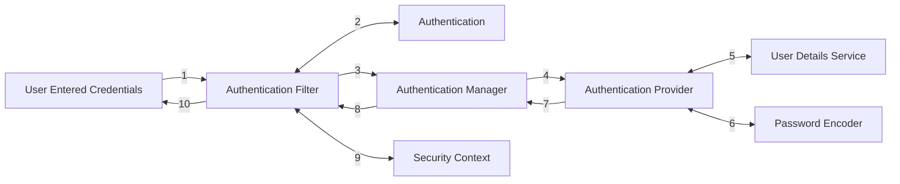
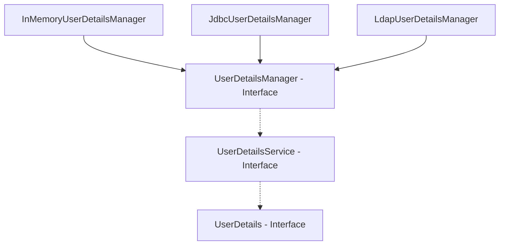

# Overview

- Protecting data and business logic
- Non Functional Requirement
- Side by side with business logic
- Avoiding common attacks

## Adding Spring Security

Add dependency: `spring-boot-security`

*This will add a login to each request of the Spring Application. It uses cookies to store user credentials.*



1. Credentials entered by user.
2. Credentials converted into `Authentication` object.
3. `AuthenticationManager` identifies the suitable `AuthenticationProvider`
4. `AuthenticationProvider` has the logic about application security. *(Like validating username & password).*
   `AuthenticationProvider` is an interface and uses two other interfaces - `UserDetailsService` and `PasswordEncoder`.
5. `UserDetailsService` holds the schema for the user.
   We may have scenario like multi-factor authentication using OTP. This logic will be identified under `User` and `UserDetailsService`.
6. `PasswordEncoder` helps to encrypt, encode, and decrypt the passwords.

8. At this point, `Authentication` object contains the data about the authorities, and roles associated with the user.
9. `SecurityContext` contains the user data once the user is authenticated.

# Changing Default Security Configuration

## Securing certain endpoints

Some endpoints of our application need user authentication and others may not. This can be configured by creating a configuration class as follows:

```java
class SecurityConfiguration extends WebSecurityConfigurerAdapter {
    /**
     *	/users - Secured
     *	/randomCoffee - Unsecured
    */
    
    @Override
    protected void configure(HttpsSecurity https) throws Exception {
        http
            .authorizeRequests()
            .antMatchers("/users").authenticated()
            .antMatchers("/randomCoffee").permitAll()
            .and()
            .formLogin().and()
            .httpBasic();
    }
}
```

## Permitting/Denying all requests

This can be the case when you want to deny any access to the application.

```java
http.
    authorizeRequests()
    .anyRequest().denyAll()
    ...
```

The opposite of this can be done as:

```java
http
    .authorizeRequests()
    .anyRequest().permitAll()
    ...
```

## User Configuration using InMemoryAuthentication

To do this, we need to override another method inside our Security Configuration class:

```java
@Override
protected void configure(AuthenticationManagerBuilder auth) throws Exception {
    auth
        .inMemoryAuthentication()
        .withUser("admin")
        .password("12345")
        .authorities("admin")
        .and()
        .withUser("user")
        .password("12345")
        .authorities("read")
        .and()
        .passwordEncoder(NoOpPasswordEncoder.getInstance());
	    // Here we configured it with no password encoder.
}
```

## User Configuration using InMemoryUserDetailsManager

```java
@Override
protected void configure(AuthenticationManagerBuilder auth) throws Exception {
    InMemoryUserDetailsManager userDetailsManager = new InMemoryUserDetailsManager;
    UserDetails user1 = User
        .withUsername("admin")
        .password("12345")
        .authorities("admin")
        .build();
    UserDetails user2 = User
        .withUsername("user")
        .password("12345")
        .authorities("read")
        .build();
    userDetailsManager.create(user1);
    userDetailsManager.create(user2);
    auth.userDetailsService(userDetailsManager);
}
```

## User Management Interfaces & Classes



### UserDetailsManager extends UserDetailsService

- `createUser(UserDetails user)`
- `updateUser(UserDetails user)`
- `deleteUser(String username)`
- `changePassword(String old, String new)`
- `userExists(String username)`

### UserDetailsService (Fetches UserDetails)

- `loadUserByUsername(String username)`

### UserDetails

- `getPassword()`
- `getUsername()`
- `getAuthorities()`
- `isAccountNonExpired()` - Account is locked
- `isAccountNonLocked()` - Credentials have expired
- `isCredentialsNonExpired()` - User is enabled or disabled.
- `isEnabled()`

## Password Validation

### Encoding

- Changing the password from one form to another.
- Involves no cryptography.
- Completely reversible.
- Should not be used for securing data.
- Can be used for compression or changing the file format.

### Encryption

- Reversible but requires a key.
- Gurantees confidentiality.
- Classification
  - Symmetric: Same key for encryption and decryption.
  - Asymmetric: Different keys for encryption and decryption. 
    Public key used for encryption. Private key required for decryption.
- Still not suitable for password management.

### Hashing

- Non-reversible.
- Suitable for password management.

## Using PasswordEncoder in the application

We will need to override another method in the Security Configuration class.

```java
@Bean
public PasswordEncoder passwordEncoder() {
    return new BCryptPasswordEncoder();
}
```

# CORS & CSRF

## CORS - Cross Origin Resource Sharing

A protocol that enables running scripts on a browser to interact with resources from different origin.
Different origin means:

- Different Domain Name
- Different Port
- Different Scheme (HTTP, HTTPS)

Such interaction between resources of different origin is blocked by the browser.

### Configuring Spring Application for CORS

We may need to do CORS when using microservices from multiple different origins or running UI on a separate origin.

WE can enable CORS in our application by adding this code to the `configure` method of the `Security Configuration` method.

```java
@Override
protected void configure(HttpSecurity http) {
    http.cors().configurationSource(new ConfigurationSource() {
	    @Override
	    public CorsConfiguration getCorsConfiguration(HttpServeletRequest request) {
            CorsConfiguration config = new CorsConfiguration();
            ...
            return config;
        }).and()
          .authorizeRequests()
            
            ...
            ...
}
```

## CSRF - Cross Site Request Forgery

This is a possible attack situation in which attacker can use the saved cookies from user's browser to access other web resources using user's credentials. 

Example: User logs in into Netflix and an authentication cookie is generated. Now if the same user clicks on some malicious link, the code from this link may try to access Netflix as CORS and will used the saved cookie. This gives him the access to Netflix account.

Solution is to use CSRF Tokens which act as a token of authentication. They go back and forth but never stored.

- User sends GET request for form.
- Website attaches a CSRF Token along it to make sure the form submission is coming back from the same authenticated form and user.

# Implementing Authorization

## Authentication - AUTHN

- Checks the identity of the user.
- Requires login details.
- 401 Error

## Authorization - AUTHZ

- Checks if the user has certain privileges/roles. Allows/denies the user to perform various actions.
- Happens after authentication. Requires privilege/role details.
- 403 Error.

## Role vs Authority

- Role is set of privileges.
  Authority is a single privilege.
- Example:
  Role: Regular, Admin, Guest
  Authority: READ, WRITE, DELETE, SHARE

#  Filters

Spring uses various filters to validate various data at the backend side.
Custom filter can be created by implementing `Filter`.
It offers options to put the filter at different points of filtering process.

# JWT Tokens

It is a JSON Web Token used to represent the claims between two parties.
